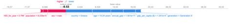
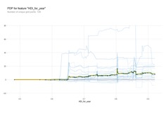

Worldwide Suicides by Gender

Modeling the Relationship Between the Human Development Index and Suicides

## Introduction

Gender is the number one predictor for suicides around the world, with men being more than twice as likely to kill themselves as women. In 2016, 16 men per 100,000 people, and 7 women per 100,000 killed themselves. This model uses data from 1985 through 2015 found on Kaggle[link]. The model uses country demographic information to attempt to predict the number of suicides for men and women. This data does not take queering of gender into account, which has a high impact on suicide rates worldwide. Global trends are difficult to track, some countries have a distinctly positive trend, others have a negative trend, and still others have no trends visible at all. It was originally assumed that the Human Development Index would be a good metric to predict suicide rates.

## 

## Data cleaning

The annual GDP was listed originally as a string with commas that needed to be removed and formatted as ints. The original data frame also included a column that had the year and country combined, which wasn’t useful for the model so it was dropped. In addition to gender, this study made use of the Human Development Index (HDI). The HDI was the only feature with missing values. To impute these values a custom function was written that used the average HDI for the country. Countries without an HDI were not included, even if suicides were reported in those countries.

It was originally planned to use the total number of suicides as the target vector but after building an initial model it was decided it would make more sense to predict the suicides/100k population. This normalization took the population from being the largest impact on the final prediction to being one of the smallest, focusing instead on the sex and HDI.

## Modeling

Originally an XGBoost regressor was fit to the data, but it was found that the model would predict values of less than zero, which didn’t make sense for this dataset. By using a random forest the range on the output was limited to being similar to that of the input, meaning that the predictions never said that a country would experience a negative number of suicides. These two SHAP (SHapley Additive exPlanations) plots are made using the same data, just using the different models. The actual suicides per 100k for this data was 3.77.

XGB:

Random Forest:

## Results

The Random Forest model was able to achieve a mean absolute error of 8.13 suicides per 100k people. This beats the mean baseline score of 13.09\. Sex is the best predictor of suicide, and men are more likely to kill themselves than women. The Human Development Index is the second best suicide predictor, followed by age, and annual GDP. These determinations were made using a feature permutation model (See figure at right)

## The HDI Surprise

A somewhat surprising finding is that suicide was not negatively correlated with an increasing HDI. It was originally assumed that as this measure of wellbeing increased, that the likelihood of suicide would decline. However, this is not the case. The HDI is a multivariate measure that accounts for life expectancy, knowledge, and standard of living ([https://en.wikipedia.org/wiki/Human_Development_Index](https://en.wikipedia.org/wiki/Human_Development_Index)). The model suggests that this measure, which is intended to capture the goodness of a human life, does not always correspond to a person’s own happiness or desire to continue their life. Further, the particular spike at .8, suggests that there may be a threshold where economic and material conditions start to matter less in terms of overall life satisfaction. There may be certain stress levels associated with this threshold, that is not experienced by people that fall below or above it on the index. A higher HDI does not always indicate a greater desire to live, even if a very high HDI does.

One thing that the HDI does not include is a measure for gender identity or expression. Other studies ([https://www.ncbi.nlm.nih.gov/pmc/articles/PMC5178031/](https://www.ncbi.nlm.nih.gov/pmc/articles/PMC5178031/)) have shown that gender, queering, and other identity issues have been associated with suicide. A future study might try to account for this factor among reported suicides.

A future study might also consider substituting the income-adjusted HDI, which more accurately expresses economic inequality and is described in Wikipedia ([https://en.wikipedia.org/wiki/List_of_countries_by_inequality-adjusted_HDI](https://en.wikipedia.org/wiki/List_of_countries_by_inequality-adjusted_HDI)).

